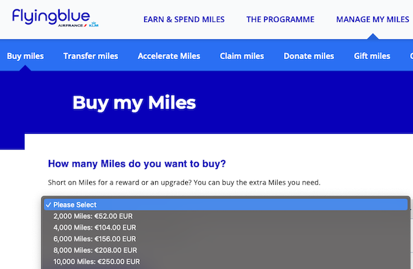

# Viajando Mais Barato com Milhas

Esse conteúdo é direcionado aos milhões de **brasileiros que moram fora**, e geralmente fazem mais viagens de longa distância
principalmente para ir ao Brasil ou familiares e amigos que vão visitá-los em outros países.

Apesar do foco, as técnicas e práticas mencionadas aqui servem 100% para quem mora no Brasil, precisando apenas de algumas
pequenas adaptações, mas **o conceito é universal**.

É possível conseguir economizar muito com essas técnicas, muitas vezes conseguindo **emitir passagens gratuitamente** apenas com suas milhas ou
com economias que pode chegar a **90%**. Mas parar não criar super expectativas, tenha em mente que economizar perto de **50%** é muito comum
quando se utiliza as ferramentas e oportunidades certas.

## A Estratégia

A estratégica descrita aqui é composta por apenas 3 grandes tópicos:

1. **[Acúmulo de Milhas](acumulo.md)**
2. **[Compra e Transferência Bonificada de Milhas](compra-transfer.md)**
3. **[Emissão de Passagens](emissao.md)**

Cada tópico é bem detalhado em suas páginas específicas, mas aqui vamos dar uma explicação geral de como 
colocar essa estratégia em prática e dicas importantes para te ajudar nessa jornada.

## Como começar?

Essa estratégia demanda tempo, e resultados mais significativos virão após meses apenas, mas **é possível começar imediatamente**
sem ter nenhuma milha acumulada, sem ter cartão de crédito ou estar em nenhum clube exclusivo de cia aérea.

É bom ter em mente que o processo todo demanda planejando e estudo, desconfie de qualquer solução milagrosa que encontrar por ai.

## Utilizando as ferramentas certas

Existem duas grandes plataformas brasileiras para compra e transferência de milhas que são excelentes, a Livelo e a Esfera, não tem nada similar desse porte
na Europa ou nos Estados Unidos, e utilizar essas plataformas é uma grande vantagem que nós temos como brasileiros, porque comprar
milhas de qualquer outra maneira é geralmente bem mais caro e não vale a pena.

Adicionalmente ainda tem a Smiles que é um ótimo portal agregador de milhas para se emitir passagens para mais de 50 cias aéreas do mundo todo.

1. **[Livelo](https://www.livelo.com.br/)** - Pertence ao grupo Bradesco. _(não é necessário ter conta no banco para criar sua conta na Livelo)_
2. **[Esfera](https://www.esfera.com.br/)** - Pertence ao grupo Santander. _(não é necessário ter conta no banco para criar sua conta na Esfera)_
3. [Smiles](https://www.smiles.com.br) - Pertence a Gol, mas é uma empresa independente com parceria com mais de 50 cia aéreas, excelente para emitir passagens de outras cias aéreas pela própria plataforma da Smiles.

Alguns pontos muito importantes antes de criar sua conta e comprar qualquer coisa:

- Será necessário um número de celular brasileiro para validar seu cadastro via SMS, na Livelo e Esfera, não tem outra opção.
- A Livelo também pede validação via SMS para linkar um smartphone via aplicativo, depois de linkado, o código de segurança é gerado dentro do App da Livelo.
- Embora as plataformas sejam gratuitas, apenas os planos pagos conseguem descontos realmente bons e podem comprar quantidades maiores de milhas.
- O valor por mil milhas _(milheiros)_ deve ficar no máximo entre R$33 e R$35, **NÃO** compre milhas mais caras que isso a menos que a cotação para sua moeda estranheira tenha valorizado muito recentemente.

Apenas para comparação simples, para comprar milhas para AirFrance / KLM por dentro da plataforma FlyingBlue, se paga uma média de 25 euros por mil milhas,
isso daria ao redor de R$132 o milheiro, ou usando a conversão inversa, pagando o preço teto do milheiro na Livelo/Esfera, sairia ao redor de 6,60 euros. _(25/07/2023)_

Confira todos os detalhes sobre compra de milhas na sessão [Compra e Transferência Bonificada](compra-transfer.md).

## Exemplo de emissão de passagem mais barata sem ter nenhuma milha

Voo **TAP**: Guarulhos ✈️ Lisboa

_(Verificado em 25 de Julho de 2023, para um voo saindo em 2 meses)_

- Classe econômica: 923,14 EUR
- Valor em milhas: 99.500 Milhas

**Os passos seriam os seguintes:**

1. Verifique o preço da passagem na cia aérea desejada e quantas milhas são necessárias para esse trecho.
2. Usando as plataformas Livelo ou Esfera, compre o valor necessário de milhas pagando um máximo de **R$35** pelo milheiro.
3. Transfira as milhas para a plataforma da cia aérea.
4. Emita as passagens usando o saldo de milhas disponível.

No exemplo citado acima, o custo dessa passagem seria:

- Classe Econômica pagando R$35 o milheiro: **R$2.842,85 -> 535 EUR** + 35,14 EUR de taxas.

Do preço original de **923,14 EUR** para **570,14 EUR**, uma economia de **38,2%**. 

Isso considerando o valor máximo sugerido para o milheiro. Essas plataformas oferecem muitas promoções quase todo mês,
onde é realisticamente possível comprar milhas pagando menos de R$30 pelo milheiro, e ainda temos as transferências bonificadas
que são detalhadas na sessão [Compra e Transferência Bonificada](compra-transfer.md) de milhas.

> **Importante**: é preciso lembrar que apenas os planos pagos conseguem comprar maiores quantidades de milhas com preços que valem a pena.

Eu sei que parece conversa de vendedor de plano pago dessas plataformas, mas é como elas fazem dinheiro também, e quando colocado
na ponta do lápis, esse custo acaba compensando.

## E se seu já tiver algumas milhas?

O precedimento é o mesmo do exemplo acima, mas você terá que comprar um número menor de milhas para completar o total necessário, 
deixando o valor total que você terá que desembolsar ainda menor.

Por isso é tão importante saber como acumular milhas, e embora seja um processo lento que requer dedicação e planejamento,
os benefícios são reais e você consegue mensurar isso facilmente quando tentar emitir suas passagens.

Vejo todos os detalhes sobre como acumular milhos na sessão [Acúmulo de Milhas](acumulo.md).

> **Importante**: é imprescindível saber quanto vale as suas milhas, sem isso você não sabe o valor real que estará pagando por uma passagem emitida por milhas.

Para sugestões, correções e qualquer tipo de conteúdo relevante que você queira ver aqui, entre em contato utilizando os links no rodapé da página.
