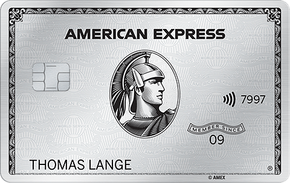

# Cartões de Crédito

> Access the english version [in here!](cards.md)!

Cartões de crédito são ótimas ferramentas para te ajudar acumular mais milhas e até multiplicar seus benefícios quando viajando.
Seja reservando hotéis, alugando carros ou consumindo nas viagens.

## Para quem são os cartões de crédito?

O primeiro conceito que precisamos estabelecer aqui é que existem cartões de crédito para todos os bolsos, e todos eles vão te ajudar muito,
às vezes em áreas diferentes, mas é sempre possível extrair seus benefícios.

E não, não é preciso ser rico e ter uma renda gigantesca para conseguir um cartão que acumule pontos.

> Importante: **SEMPRE** pague sua fatura 100%, os juros do cartão de crédito são exorbitantes e podem comprometer sua saúde financeira.

## Quais os tipos mais comuns de cartões de crédito?

Quando se trata de cartões com foco em milhas ou benefícios de viagem, podemos resumir os cartões da seguinte forma:

- Cartões emitidos por cias aéreas.
- Cartões emitidos por bancos, com possibilidade de pontuar em programas aéreos.
- Cartões emitidos por bancos ou grande lojas, com programa próprio de pontos, mas que tem parceria de transferência para milhas aéreas.

Obviamente essas opções dependem muito do seu mercado local, em quais são as cias aéreas do seu país e com quais lojas e bancos elas tem parceria.

> Os exemplos aqui são quase todos focados na Alemanha ou Europa no geral, mas o conceito é o mesmo em qualquer país.

## Como acumular pontos/milhas no cartão de crédito?

Parece simples, mas vão aqui algumas dicas para maximizar o uso do seu cartão e acumular ainda mais milhas.

- Tente acumular o máximo possível dos seus gastos no seu cartão.
- Cadastre todas as contas online para utilizar seu cartão, ou uso algo como PayPal para centralizar todos os gastos online e adicione seu cartão como meio principal de pagamento dentro do PayPal.
- PayPal é uma das poucas plataformas de pagamento que aceita cartão American Express.
- Se você tem um cartão Amex onde a aceitação é baixa, tenha um segundo cartão, Visa ou Mastercard, que também gere milhas/pontos.
- Tente pesquisar o histórico de promoções para Bônus de Boas-Vindas _(Welcome Bonus)_ do seu cartão, em alguns casos vale a penas esperar algumas semanas por uma nova promoção.
- Indique amigos e familiares que também possam se beneficiar do mesmo cartão que o seu, para se cadastrarem usando seu link de referência, assim você quando os pontos de indicação.
- Pague suas contas do dia a dia usando o cartão de crédito.

### Qual é a diferença entre Bônus de Boas-Vindas e Bônus de Referência?

### Ferramentas para pagar contas com seu cartão e maximizar os pontos

Em muito países, não é comum pagar contas com cartão de crédito, apenas debito em conta bancária ou transferência bancária.
Uma alternativa é tentar usar o cartão para _"depositar"_ o valor que se precisa para pagar uma conta, e assim acumular mais pontos.

> Importante: jamais pague uma conta como descrito aqui, se você já não tiver o dinheiro separado em sua conta bancária, não faça dívidas no cartão de crédito,
> os juros são exorbitantes e vão te complicar financeiramente.

- [Revolut](https://revolut.com/referral/?referral-code=luizegppz): aceita _"depósito"_ usando cartão de crédito. _(é cobrado taxa em alguns países, verifique as regras locais)_
- [Wise](https://wise.com/invite/ih/luizg): não aceita cartões Amex, é cobrado taxa em alguns países, verifique as regras locais.
- [PayPal](https://www.paypal.com): única plataforma que aceita cartões Amex.
- [PaySend](https://www.paysend.com)
- [Remitly](https://www.remitly.com/)

> **Importante**: Verifique as regras locais de cada um dos serviços citados, em alguns países nem todas as funcionalidades 
> estão disponíveis, ou taxas são cobradas.
> 
> Cuidado especial com o **Revolut** que em alguns países não deixa movimentar o dinheiro _"depositado"_ via cartão de crédito, 
> só pode usar para pagamentos feitos com o cartão Revolut.

## Cartões de Crédito na Alemanha 🇩🇪

Na Alemanha a utilização de cartões de crédito não é muito comum, embora se tenha bastante opções, raramente se tem muitos benefícios.

Depois de alguns messes pesquisando algumas opções, a tabela acima foi criada como uma referência mais completa, baseada 
totalmente nos meus próprios critérios voltados a viagem.

Items importantes nos meus critérios de avaliação:

- Programa de Milhas ou Pontos _(ou cashback)_
- Seguros viagem inclusos: Cancelamento de voo, atraso de voo, extravio de bagagem, cancelamento da viagem por motivo de doença, cobertura para locação de carros.
- Valor da anuidade
- Benefícios adicionais
- Taxa para uso em moeda estrangeira

Alguns pontos importantes em relação aos cartões **[Amex](https://americanexpress.com/de-de/referral/lUIZGzN8h?XLINK=MYCP)**:

- A aceitação na Alemanha é bem baixa, embora um pouco melhor em outros países europeus, mas ainda assim não chega nem perto de Visa e Mastercard.
- Não é viável ter apenas um cartão se ele for Amex, é mandatório ter um segundo cartão.
- O cartão **Platinum** é o melhor cartão sem sombras de dúvida, e é possível pegar algumas promoções com Bonus de Boas-Vindas que praticamente pagam um viagem intercontinental ida e volta.
- A anuidade assusta, mas existem muitos benefícios e bônus "em dinheiro", que reduzem (virtualmente) o valor da anuidade se você realmente utilizar esses bônus.
- Eu recomendo muito todo mundo ter pelo menos o cartão [Amex Payback](https://americanexpress.com/de-de/referral/lUIZGzN8h?XLINK=MYCP) que é gratuito. (por favor use o meu [link de referência](https://americanexpress.com/de-de/referral/lUIZGzN8h?XLINK=MYCP))

> Se você estiver pensando em assinar qualquer outro cartão Amex que não seja o Payback, **NÃO** assine o Payback antes!
> 
> É preciso esperar 18 meses para ser elegível a receber os Bônus de Boas-Vindas se você já tiver um cartão Amex.
 
O cartão [Eurowings Premium](https://www.barclays.de/kreditkarten/eurowings-premium/) foi o que mais passou em cada item dos meus critérios.

Ele gera milhas Miles & More, tem uma cobertura de seguros excelente, melhor que do Amex Platinum, não tem taxas extras para moedas estrangeiras, com alguns poucos benefícios extras caso você utilize a Eurowings alguma vez na vida.

Caso o pacote de seguros um pouco menos completo já lhe sirva, o **Eurowings Classic** é a melhor opção para gerar milhas Miles & More e ainda ter alguns benefícios extras.

Hoje, meu setup pessoal é composto pelos cartões [Eurowings Premium](https://www.barclays.de/kreditkarten/eurowings-premium/) e
[Amex Payback](https://americanexpress.com/de-de/referral/lUIZGzN8h?XLINK=MYCP), que será futuramente atualizado para outro modelo se alguma promoção muito grande aparecer.
