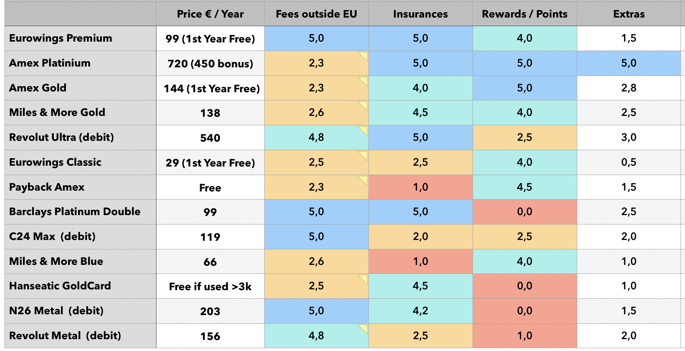

## Credit Cards in Germany 🇩🇪

Germany is known worldwide as one of _(if not the only)_ a very few developed countries where the vast majority os daily payments are made in cash.
As you can expect, the usage of credit cards is not very common, even tho there are many options available.

Credit cards in general here, has very few perks a lot when comparing with other countries.

After several weeks researching the topic, the table above was created as a more complete reference, based on
my own totally travel-focused criteria.

Important items in my evaluation criteria:

- Miles or Rewards Program _(or cashback)_
- Travel insurance included: Flight cancellation, flight delay, luggage loss, trip cancellation due to illness, car rental coverage.
- Annuity value
- Additional benefits/perks
- Fees on foreign currency conversion

Some important points regarding **[Amex](https://americanexpress.com/de-de/referral/lUIZGzN8h?XLINK=MYCP)** cards:

- Acceptance in Germany is quite low, although a little better in other European countries, but still not even close to Visa and Mastercard.
- It is not feasible to have only one card if it is Amex, it is mandatory to have a second card _(that also gives rewards/miles)_.
- The Amex **Platinum** card is the best card without a doubt, and it is possible to get some promotions with Welcome Bonus that practically pay for an overseas round trip.
- The annual fee scares, but there are many benefits and _"cash"_ bonuses, which reduce (virtually) the value of the annul fee if you **really** use these bonuses.
- I highly recommend everyone to have at least the [Amex Payback](https://americanexpress.com/de-de/referral/lUIZGzN8h?XLINK=MYCP) card which is free. (please use my [referral link](https://americanexpress.com/de-de/referral/lUIZGzN8h?XLINK=MYCP))

> If you are considering subscribing to any other Amex card other than Payback, **DO NOT** subscribe to Payback first!
>
> You must wait 18 months to be eligible to receive **Welcome Bonuses** if you already have _(or have had)_ an Amex card.

The [Eurowings Premium](https://www.barclays.de/kreditkarten/eurowings-premium/) card was the best scoring overall in my criteria.

It generates **Miles & More** miles, has excellent insurance coverage, similar or slight better than Amex Platinum, has no extra fees for foreign currencies,
with a few extra benefits if you ever fly with **Eurowings** in your life.

If a slightly less complete insurance package already suits you, the **Eurowings Classic** is the best option to generate Miles & More miles, with a few extra perks.

Today, my personal setup consists of [Eurowings Premium](https://www.barclays.de/kreditkarten/eurowings-premium/) and
[Amex Payback](https://americanexpress.com/de-de/referral/lUIZGzN8h?XLINK=MYCP), which will be upgraded to another Amex model in the future when a big promotion is in place.
