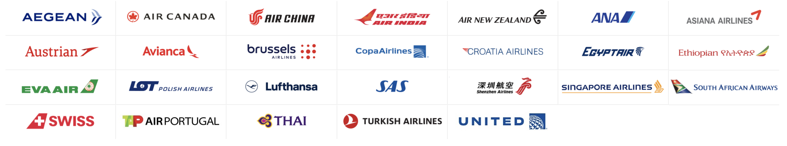
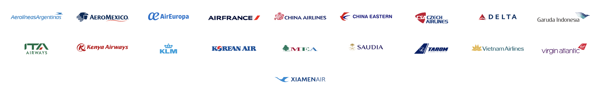
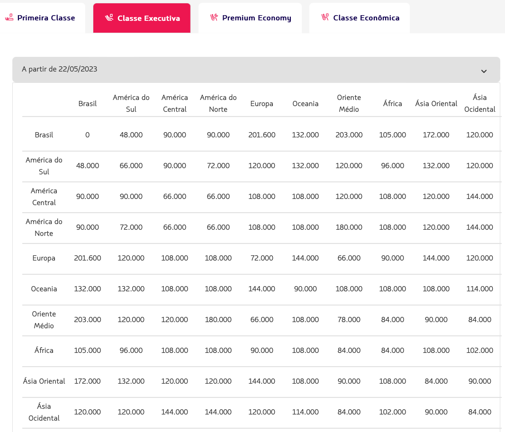
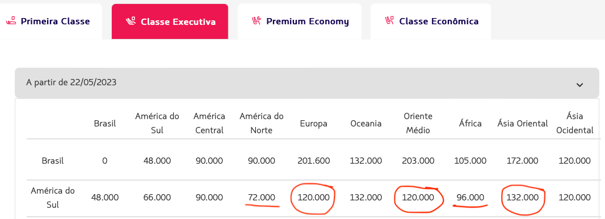
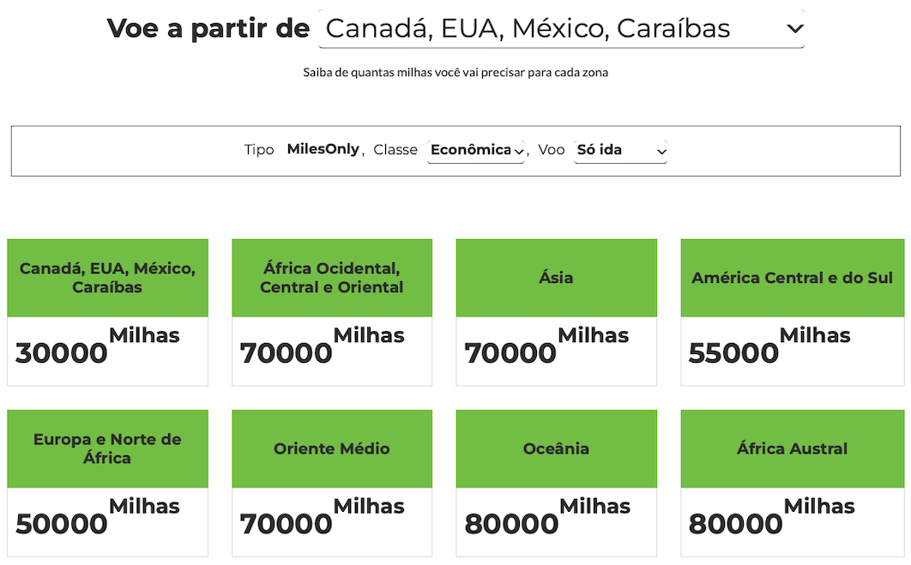
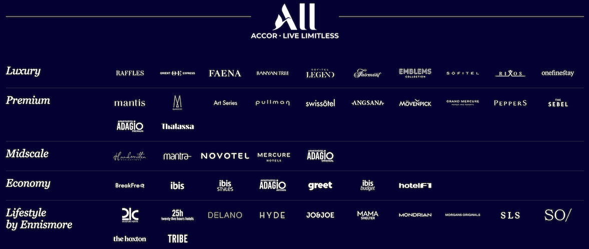
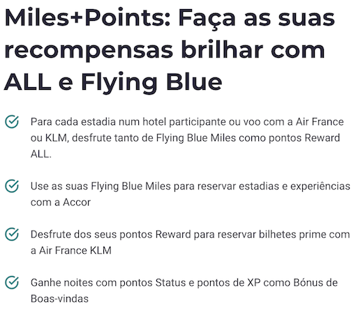

# Alianças Aéreas

Um fator muito importante para montar a sua estratégica, do acúmulo, à compra e transferência, até a emissão de passagens, 
é entender como as cias aéreas funcionam entre si e quais são as suas opções na hora de escolher onde acumular milhas.

As alianças aéreas, são grupos formados por várias cias que geralmente compartilhar do mesmo programa de milhas.
Ou seja, se você acumula pontos **Avios**, é possível transferir esses pontos para outras cias aéreas da mesma aliança que usa esses pontos, 
ou, por dentro do site de uma das cias, emitir uma passagem para outra cia da mesma aliança, usando as suas milhas.

Muitas vezes quando se faz uma busca de passagem no site de uma cia, os resultados já trazem outras cias da mesma aliança.

Com isso você não precisa necessariamente se apegar a uma única cia aérea, e não depender somente da cia local do seu país.
Exemplo, se você mora na Alemanha, você não precisa pensar somente na Lufthansa, sabendo que com as mesmas milhas, 
você pode emitir uma passagem pela TAP, numa promoção muito melhor, ou ao ter uma transferência bonificada ótima para 
transferir pontos Livelo para a KLM, por exemplo.

Ainda seria necessário um voo curta distância dentro da Europa, que você pode fazer de _low-cost_ e ainda gastar muito menos 
do que se comprasse uma passagem em dinheiro, da Lufthansa.

## [Star Alliance](https://www.staralliance.com) - _Miles & More_

A Star Alliance é a maior aliança aérea do mundo, e conta com a Lufthansa como principal membro. Você pode acumular milhas 
voando por qualquer uma das cias da aliança e usar (ou transferir) essas milhas em qualquer uma das cias da aliança. 
Ou seja, você pode voar pela Lufthansa, acumular milhas no programa Miles & More, e transferir essas milhas para a TAP, 
e emitir uma passagem pela TAP usando as milhas acumuladas na Lufthansa.

A Star Alliance é atualmente composta por 26 cias aéreas:

> Adria Airways, Aegean Airlines, Air Canada, Air China, Air India, Air New Zealand, ANA, Asiana Airlines, Austrian, Avianca, 
> Avianca Brasil, Brussels Airlines, Copa Airlines, Croatia Airlines, EGYPTAIR, Ethiopian Airlines, EVA Air, LOT Polish Airlines, 
> Lufthansa, Scandinavian Airlines, Shenzhen Airlines, Singapore Airlines, South African Airways, SWISS, TAP Air Portugal, THAI, Turkish Airlines, United.

Confira todas as cias aéreas da Star Alliance [aqui](https://www.staralliance.com/en/member-airlines).

Você pode se cadastrar no programa Miles & More [aqui](https://www.miles-and-more.com/row/en/join.html).

## [SkyTeam](https://www.skyteam.com) - _Flying Blue_

A SkyTeam é a segunda maior aliança aérea do mundo, e conta com a Air France como principal membro. Você pode acumular milhas 
voando por qualquer uma das cias da aliança e usar (ou transferir) essas milhas em qualquer uma das cias da aliança. 
Ou seja, você pode voar pela Air France, acumular milhas no programa Flying Blue, e transferir essas milhas para a KLM, 
e emitir uma passagem pela KLM usando as milhas acumuladas na Air France.

A SkyTeam é atualmente composta por 19 cias aéreas:

> Aeroflot, Aerolíneas Argentinas, Aeroméxico, Air Europa, Air France, Alitalia, China Airlines, China Eastern, Czech Airlines, 
> Delta Air Lines, Garuda Indonesia, Kenya Airways, KLM, Korean Air, Middle East Airlines, Saudia, TAROM, Vietnam Airlines, XiamenAir.

Confira todas as cias aéreas da SkyTeam [aqui](https://www.skyteam.com/en/about/member-airlines/).

Você pode se cadastrar no programa Flying Blue [aqui](https://flyingblue.com/).

## [OneWorld Alliance](https://www.oneworld.com) - _British Airways_

A OneWorld Alliance é a terceira maior aliança aérea do mundo, e conta com a British Airways como principal membro. Você pode acumular milhas 
voando por qualquer uma das cias da aliança e usar (ou transferir) essas milhas em qualquer uma das cias da aliança. 
Ou seja, você pode voar pela British Airways, acumular milhas no programa British Airways Executive Club, e transferir essas milhas 
para a Iberia, e emitir uma passagem pela Iberia usando as milhas acumuladas na British Airways.

A OneWorld é atualmente composta por 13 cias aéreas:

> American Airlines, British Airways, Cathay Pacific, Finnair, Iberia, Japan Airlines, Malaysia Airlines, Qantas, Qatar Airways, Royal Jordanian, SriLankan Airlines.

Confira todas as cias aéreas da OneWorld Alliance [aqui](https://www.oneworld.com/member-airlines/overview).

Você pode se cadastrar no programa British Airways Executive Club [aqui](https://www.britishairways.com/en-gb/executive-club).

## [IAG (International Airlines Group)](https://www.iairgroup.com/) - _Avios_

O International Airlines Group é um grupo de cias aéreas que inclui a British Airways, Iberia, Aer Lingus, Vueling e Level, 
e conta com o programa de milhas **Avios**. 

Confira todas as cias aéreas do IAG [aqui](https://www.iairgroup.com/en/our-brands).

Você pode se cadastrar no programa Avios [aqui](https://www.avios.com/gb/en).

## Entendendo o que são as Tabelas Fixas 

As cias aéreas costumam ter uma tabela de valores para emissão de passagens por outras cias aéreas, sejam da mesma aliança 
ou cias parceiras de outras alianças. Essa tabela é chamada de **Tabela Fixa**.

Diferentemente dos preços variáveis das passagens normais, as tabelas fixas possuem valores fixos, em milhas, para conversão 
de milhas para emissão de passagens em outras cias. Você não pode usar e tabela fixa para viajar pela mesmo empresa, **a 
tabela fixa funciona apenas para emissão com cias parceiras**.

### Exemplo: [Tabela Fixa da Latam](https://latampass.latam.com/pt_br/viagem/usar-pontos-para-voar/regras-de-resgate/latam/classe-economica)

A tabela fixa da Latam, mostra todos os valores, em milhas, para emissão de passagem de qualquer uma das regiões do mundo 
para qualquer outra região. Esses valores não mudam, eles são fixos, não importante o quanto perto da data do voo você emita a passagem.

Obviamente, a emissão é sujeita a disponibilidade de assentos no voo desejado.

Exemplos:

- Passagem saindo do Brasil com destino Europa: 201.600 mil milhas na classe Executiva.
- Passagem saindo dos EUA com destino África: 108.000 mil milhas na classe Executiva.

Com isso, você pode se programar conforme a viagem desejada e ir acumulando milhas sabendo qual é o seu alvo final.

Tem um detalhe importante que pode fazer muita diferença e passa despercebido por muita gente:

Alguns trechos são muito mais baratos saindo de outros países da América do Sul, do que saindo do Brasil, podendo chegar a 40% de diferença.

Você poderia então emitir uma passagem saindo da Argentina 🇦🇷, por exemplo, ir até lá com uma cia _low-cost_, ou até de ônibus, e economizar muito mais milhas.

Obviamente isso depende de onde você esta no Brasil e conseguir passagens baratas para chegar até o país vizinho.

**Dicas importantes:**

- As parcerias da Latam não são fixas, é preciso pesquisar antes quais empresas podem ser utilizadas com a tabela fixa.
- Pesquise os voos desejados no site da Latam, ou usando Google Flights, Sky Scanner, você precisará informar qual é o seu voo desejado.
- É preciso ligar na central da Latam para conseguir emitir as passagens usando a tabela fixa. Após ligar, use as **opções 2 > 3 > 1**. Quando um agente te atender, peça para ser **transferido para a central de emissão com tabela fixa**.
- Outra opção é fazer pelo WhatsApp oficial da Latam: escreva **"RESGATAR PASSAGEM COM LATAM PASS"** ou **"AGENTE"** e siga o roteiro de pedir emissão com a tabela fixa.

### Exemplo: [Tabela Fixa da TAP](https://www.flytap.com/pt-br/miles-and-go/utilizar-milhas/comprar-bilhete)

Na TAP as coisas são um pouco mais simples, é possível fazer tudo pelo site mesmo.

**Navegue para TAP Miles&Go > Como Reservar com Milhas**

Depois é só escolher **"Star Alliance"** ou **"Outras companhias"**, e você consegue ver os valores necessários em milhas para cada trecho.

# Grupos Hoteleiros

Assim como as cias aéreas, os grupos hoteleiros também possuem parcerias entre si, e você pode transferir os pontos de uma rede hoteleira para 
emitir passagens em uma cia aérea, ou usar os pontos de uma cia aérea para emitir diárias ou upgrades em um hotel.

Saber quais hotéis pertencem a qual grupo, pode te ajudar a planejar melhor suas viagens e acumular pontos que podem ser utilizados depois para emissão de passagens aéreas.

Abaixo estão listados alguns dos principais grupos hoteleiros e suas respectivas redes de hotéis.

## [Accor Hotels - _ALL - Accor Live Limitless_](https://all.accor.com/)

A Accor Hotels é uma das maiores redes de hotéis do mundo, e possui parcerias com diversas cias aéreas, como a LATAM, TAP, Iberia, Emirates, entre outras.

O grupo possui diversas redes de hotéis, como: Ibis, Novotel, Mercure, Sofitel, Pullman, entre outras.

A lista completa pode ser vista na [página de marcas da Accor](https://all.accor.com/brands/index.en.shtml).

Atualmente, existe uma parceria bem interessante com a AirFrance / KLM, onde você pode acumular pontos no programa de fidelidade da Accor (ALL) e 
milhas FlyingBlue da AirFrance / KLM, **simultaneamente**, pontuação dupla, e se você pagar com o cartão de crédito 
que também pontue em qualquer programa, você ganha **PONTUAÇÃO TRIPLA**.

Além disso, é possível transferir seus pontos ALL para muitas outras ciás aéreas, como pode ser verificado 
na [página dos parceiros da Accor](https://all.accor.com/a/pt/portugal/loyalty-program/partners/airlines.html).

## [Marriott - _Marriott Bonvoy_](https://www.marriott.com/)

A Marriott é outra gigante do setor hoteleiro, e possui parcerias com mais de 30 cias aéreas.

O grupo Marriott possui diversas redes de hotéis, em seguimentos mais luxuosos, como o Ritz-Carlton, e redes mais simples, como o Courtyard.

Você pode conferir todas as redes de hotéis da Marriott na [página de marcas da Marriott](https://www.marriott.com/marriott-brands.mi).

Além disso, é possível transferir seus pontos Marriott para muitas outras ciás aéreas, como pode ser verificado
na [página dos parceiros da Marriott](https://www.marriott.com/loyalty/redeem/travel/points-to-miles.mi).

A conversão de pontos Marriott para milhas aéreas é de 3 pontos Marriott para 1 milha aérea para quase todas as cias aéreas.

## [IHG - _IHG Rewards Club_](https://www.ihg.com/)

A IHG é um dos maiores grupos hoteleiros do mundo, e possui parcerias com diversas cias aéreas, como a LATAM, TAP, Iberia, Emirates, entre outras.

O grupo possui diversas redes de hotéis, como: Holiday Inn, InterContinental, Crowne Plaza, entre outras.

A lista completa pode ser vista na [página de marcas da IHG](https://www.ihg.com/content/us/en/about/brands).

Ainda tem outras grandes redes hoteleiras como a [Radisson](https://www.radissonhotels.com/en-us/), 
[Hilton](https://www.hilton.com/en/), [Hyatt](https://www.hyatt.com/), entre outras. 
Todos possuem parcerias com muitas cias aéreas, programas próprios de fidelidade, e até cartões de crédito próprios.

Estude quais das redes pode ser mais interessante para você, quais benefícios podem valer mais a pena para o seu caso, 
se cadastre e comece a acumular pontos para suas próximas viagens.

✈️ 🏨
